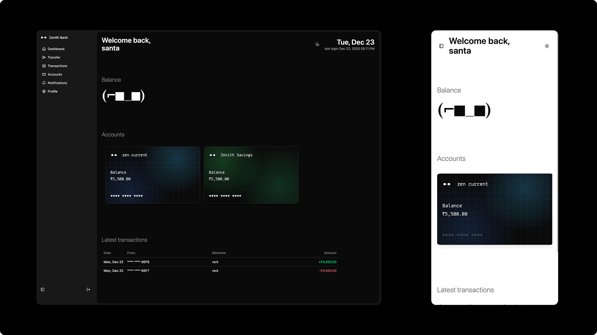
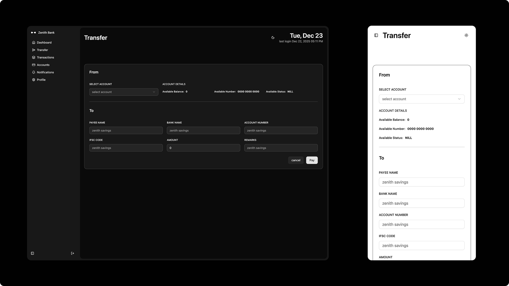
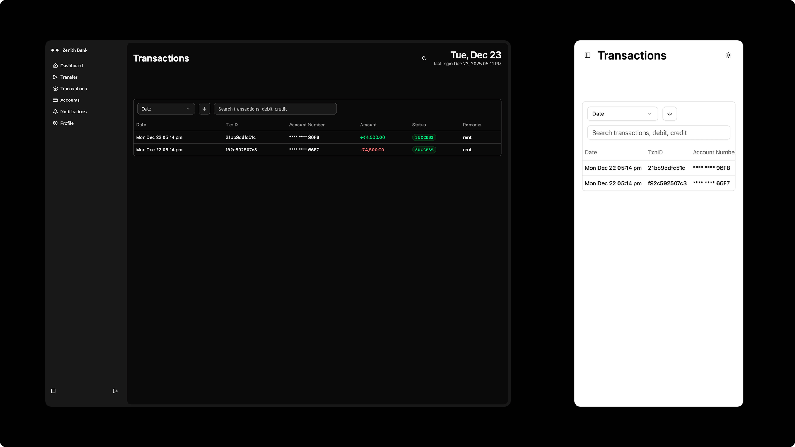
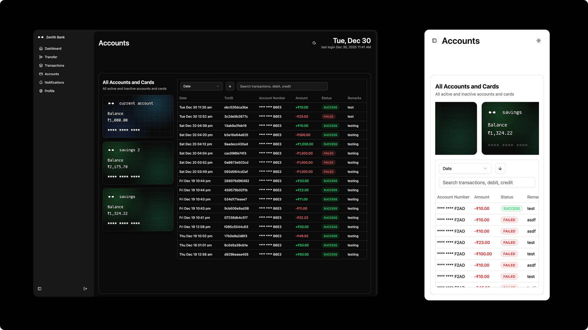
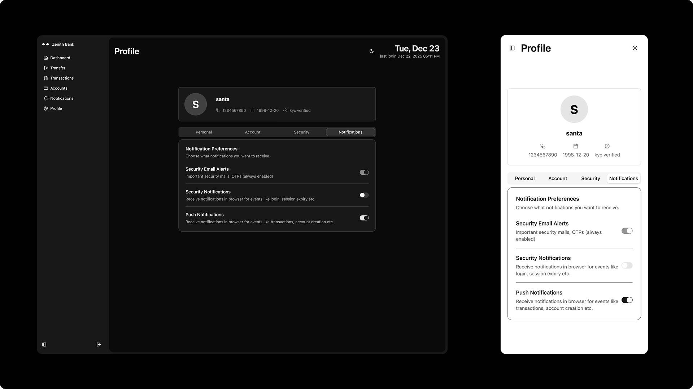

# 🖥️ Zenith Pay – Frontend


---

## 🏗️ Overview

The **Zenith Pay Frontend** is a **secure React single-page application** designed to interact with the Zenith Pay backend through an API Gateway.

The frontend focuses on **auth correctness, backend-driven onboarding, responsive design, and predictable server-state management**.

---

## 🔗 Backend Repository

The frontend consumes APIs exposed by the **Zenith Pay Backend**, which is built using Spring Boot microservices and secured via an API Gateway.

👉 **Backend Repository:**  
https://github.com/notsanta20/zenith-pay

---

## ⚙️ Tech Stack

- **Frontend:** React, TypeScript
- **Build Tool:** Vite
- **Styling:** Tailwind CSS, shadcn/ui
- **Routing:** React Router
- **State Management:** React Context
- **Server State:** TanStack Query
- **Forms & Validation:** TanStack Form, Zod
- **HTTP Client:** Axios

---

## 📸 Screenshots

<div align="center">
    <h4 align="center">Dashboard</h4>
    
    <h4 align="center">Transfer</h4>
    
    <h4 align="center">Transactions</h4>
    
    <h4 align="center">Accounts</h4>
    
    <h4 align="center">Profile & Settings</h4>
    
</div>
---

## 🔐 Authentication Flow

- JWT stored in **HttpOnly cookies**
- No token stored in localStorage or sessionStorage
- Auth state derived from backend using `verify-user` API
- Logout clears cookies via backend API

---

## 🧭 Routing & Onboarding

Routing is **state-driven** based on backend bootstrap data:

1. Profile not completed → Create Profile
2. Account not created → Create Account
3. Fully onboarded → Application Dashboard

Public routes:
- `/`
- `/login`
- `/register`

All other routes are protected.

---

## 👤 Profile, Security & Notifications

- **Profile Management:**  
  Users can view and update profile details such as name and contact information.

- **Security Settings:**  
  Supports secure password updates with validation and backend verification.

- **Notification Preferences:**  
  Users can enable or disable notification types (e.g., transaction updates, security alerts).

- **Notifications Inbox:**  
  A dedicated notifications page displays unread and historical notifications, allowing users to mark them as read.

---

## 📱 Responsive Design

- Mobile-first UI design
- Tailwind CSS responsive utilities
- Optimized layouts for:
  - Mobile
  - Tablet
  - Desktop

---

## ⚙️ Environment Configuration

The frontend is environment-driven.

### `.env` file

```env
VITE_BACKEND_SERVER_URL="http://gateway-host:8089"
```

---

## 🚀 Start service

```
npm install
npm run dev
```
